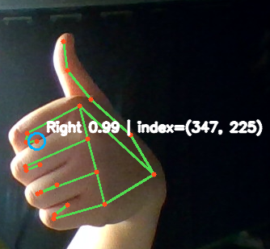

# Virtual Whiteboard

## 환경 구성 (Windows PowerShell)

Python 3.11 x64 설치 후 프로젝트 루트에서 실행합니다. MediaPipe 호환성을 위해 현재는 Python 3.11을 권장합니다.

``` base
py -3.11 -m venv venv

#powershell
.\venv\Scripts\Activate.ps1

#bash
source venv/Scripts/Activate

# macOS / Linux
python3.11 -m venv venv
source venv/bin/activate

python -m pip install --upgrade pip
python -m pip install -r requirements.txt
```

## 샘플 실행

```powershell
python -m samples.mediapipe_hands
```

다른 카메라는 `--camera 1`처럼 선택합니다. 실행 창에서 `Q`를 누르면 종료됩니다. 카메라 접근이 차단되면 Windows 설정의 **개인 정보 및 보안 > 카메라**에서 데스크톱 앱 접근을 허용해야 합니다.

`core/tracker.py`는 UI와 독립적이며, 손을 잃은 프레임에서는 빈 목록을 반환합니다. `TrackedHand.index_fingertip`이 향후 펜 좌표 입력점입니다.

정상 실행시 아래 이미지와 같이 손 트래킹이 가능합니다.

